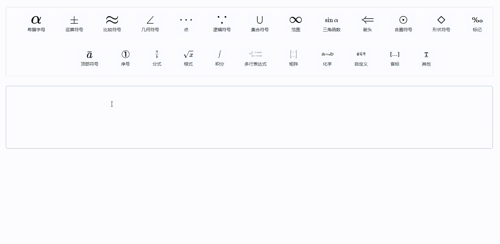

# Latex-Editor

TODO: 2022-10-26

- [x] 梳理公式 (太多，233...)
- [x] 点击加入到光标最后所在位置
- [x] 手动移动光标活输入文本后能拿到光标位置
- [x] UI 补充图标

## 2022-11-30 日效果如下

TODO: 2022-11-30

- [ ] 文档
- [ ] 公式块删除
- [ ] latex 关键字和括号添加颜色
